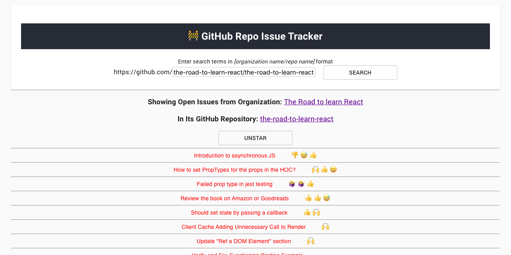

# React GraphQL GitHub Repo Issue Checker

Consuming the GraphQL-based Github API, users can browse Github issues (and first three emoji reactions, if any) by entering an organization's repo name. Assumes a forward slash between both fields, as in "facebook/create-react-app".

With poor form validation and a very basic front-end, this is still a great practice application for building GraphQL applications, based on Robin Wierich's [The Road to GraphQL](https://roadtoreact.com/course-details?courseId=THE_ROAD_TO_GRAPHQL).

Given the API key, the app assumes the user is a GitHub user and can search for organization and repo combinations. Features include

-   default display of five most recent open issues,
-   pagination,
-   starring and unstarring the repo,
-   total star count inside star toggle button

## Available Scripts

`git clone` this repo, then `cd react-graphql-github-vanilla` into the project directory, and run:

### `yarn` or `yarn install`

### secure your environment with api key

In the project root directory (next to src folder), run `touch .env`. Open the file then enter your new Github Personal Access Token created using [this guide](https://help.github.com/en/github/authenticating-to-github/creating-a-personal-access-token-for-the-command-line) as :
`REACT_APP_GITHUB_PERSONAL_ACCESS_TOKEN=abcdthisisnotarealkey1245679` (no string quotation marks).

Add `.env` to your .gitignore to avoid broadcasting your secure key to the universe.

Then start the app, now as a pre-authorized github user:

### `yarn start`

Runs the app in the development mode. 
Open [http://localhost:3000](http://localhost:3000) to view it in the browser.
